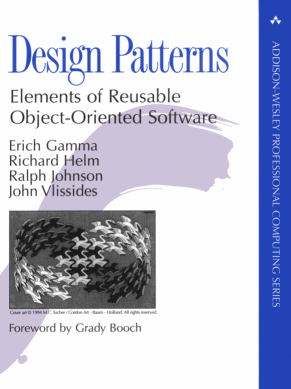

# Java_Design_Pattern

# GoF(Gangs of Four)
Gangs of Four Design Patterns는"Design Patterns: Elements of Reusable Object-Oriented Software"라는 책에서 23개의 디자인 패턴 모음입니다.

## GOF의 역사

"1994년에 처음 출간된 이 책은 디자인 패턴을 배우는 데 있어 가장 인기있는 참고 자료 중 하나입니다. 이 책은 Erich Gamma, Richard Helm, Ralph Johnson 및 John Vlissides 등 네 명의 저자가 집필하였습니다. 이들 네 명의 저자들로 인해 이 책은 Gangs of Four 디자인 패턴이라고도 불립니다. 더 간결하게는 'GoF 디자인 패턴'이라고도 합니다."

## GOF의 중요성 

"소프트웨어 설계 시 이전의 경험은 매우 중요합니다.
하지만 모든 사람이 다양한 경험을 가질 수는 없습니다. 
그래서 지식 공유를 위해 GOF(Gang of Four) 디자인 패턴이 등장했습니다. 
이 패턴은 객체지향 개념에 따른 재사용 가능한 설계를 정리한 것입니다. GOF 디자인 패턴을 잘 이해하고 활용하면 경험이 부족해도 좋은 소프트웨어 설계가 가능합니다."

## GOF 패턴

### 생성 패턴 (Creational Design Patterns)

객체를 생성하는 것과 관련된 패턴으로, 객체의 생성과 변경이 전체 시스템에 미치는 영향을 최소화 하며,
코드의 유연성과 확장성을 높여주며, 재사용성이 향상 됩니다.

* Factory Method  

팩토리 패턴은 객체 생성을 전담하는 별도의 클래스(팩토리 클래스)를 만들어, 객체를 생성하는 과정을 캡슐화하는 설계 방식입니다. 이를 통해 객체 생성 로직을 한 곳에서 관리하고, 필요한 객체를 쉽게 얻을 수 있습니다.
* Singleton  

싱글톤 패턴은 클래스가 오직 한 개의 인스턴스만 가지도록 설계하는 방법입니다. 이를 통해 클래스가 여러 번 생성되지 않도록 제한하며, 동일한 객체를 공유할 수 있습니다.
* Prototype 

다른 유사한 인스턴스에서 새 개체 인스턴스를 생성한 다음 요구 사항에 따라 수정합니다.
* Builder

개체를 단계별로 생성하고 마지막으로 개체 인스턴스를 가져오는 메서드입니다.
* Abstract Factory

추상 팩토리는 여러 팩토리 클래스들을 관리하는 상위 팩토리 클래스를 생성하는 패턴입니다. 이를 통해 관련된 객체들을 그룹화하여, 구체적인 클래스에 의존하지 않고 일관된 방식으로 객체를 생성할 수 있습니다

### 구조 패턴 (Structural Design Patterns)

구조 패턴은 프로그램의 구조를 설계하는 데 도움이 되는 디자인 패턴입니다. 이 패턴은 데이터 구조, 인터페이스 구조 등을 개선하여 프로그램의 큰 구조를 쉽게 만들 수 있게 합니다.

큰 시스템에서는 많은 클래스들이 서로 의존하게 되는데, 구조 패턴은 이런 복잡한 구조를 보다 간단하게 만들어 개발과 유지 보수를 용이하게 합니다. 이를 통해 개발자는 시스템의 전체 구조를 더 효율적으로 관리할 수 있습니다.
* Adpater

서로 다른 인터페이스를 가진 클래스들을 함께 사용할 수 있도록 인터페이스를 변환하는 패턴입니다.
* Composite

개별 객체와 복합 객체를 동일한 방식으로 다룰 수 있게 해주는 패턴입니다.
* Bridge

구현과 추상화를 분리하여 독립적으로 변화할 수 있게 하는 패턴입니다.
* Decorator

객체에 동적으로 새로운 기능을 추가할 수 있도록 하는 패턴입니다.
* Facade

복잡한 서브시스템에 대해 간단한 인터페이스를 제공하는 패턴입니다.
* Flyweight

메모리 사용량을 줄이기 위해 공유 가능한 객체를 재사용하는 패턴입니다.

* Proxy

다른 객체에 대한 접근을 제어하거나 간접적으로 처리할 수 있는 대리 객체를 생성하는 패턴입니다.

### 행위 패턴 (Behavioral Design Patterns)

반복적으로 사용되는 객체들의 상호작용을 패턴화한 것으로, 클래스나 객체들이 상호작용하는 방법과 책임을
분산하는 방법을 제공 합니다. 행위 패턴은 행위 관련 패턴을 사용하여 독립적으로 일을 처리하고자 할 때 사용 합니다. 

* Template Method

템플릿 메서드 스텁을 만들고 일부 구현 단계를 하위 클래스로 연기하는 데 사용됩니다.
* Mediator

시스템의 서로 다른 개체 간에 중앙 집중식 통신 매체를 제공하는 데 사용됩니다.
* Chain of Responsibility	

클라이언트의 요청이 객체 체인으로 전달되어 이를 처리하는 소프트웨어 설계에서 느슨한 결합을 달성하는 데 사용됩니다.
* Observer

개체의 상태에 관심이 있고 변경 사항이 있을 때마다 알림을 받으려는 경우에 유용합니다.
* Strategy

Strategy 디자인 패턴은 특정 작업에 대한 여러 알고리즘이 있고 클라이언트가 런타임에 사용할 실제 구현을 결정할 때 사용됩니다.
* Command

Command 디자인 패턴은 요청-응답 모델에서 연결 해제를 구현하는 데 사용됩니다.
* State

State 디자인 패턴은 개체가 내부 상태에 따라 동작을 변경할 때 사용됩니다.
* Visitor

Visitor 디자인 패턴은 유사한 종류의 개체 그룹에 대해 작업을 수행해야 할 때 사용됩니다.
* Interpreter

언어의 문법적 표현을 정의하고 이 문법을 처리할 통역사를 제공합니다.
* Iterator

개체 그룹을 통과하는 표준 방법을 제공하는 데 사용됩니다.

* Memento

memento 디자인 패턴은 나중에 복원할 수 있도록 개체의 상태를 저장하려는 경우에 사용됩니다.