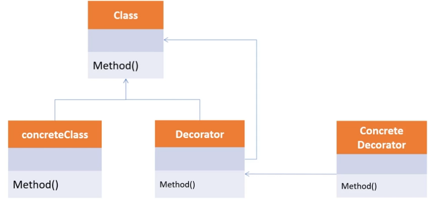

# Adapter Pattern Principles

## 원리

Decorator_Pattern은 기존 뼈대(Class)는 유지하되, 이후 필요한 형태로 꾸밀 때 사용합니다.
확장이 필요한 경우 상속의 대안으로도 활용합니다. SOLID중에서 개방폐쇄 원칙(OCP)과 의존 역전 원칙(DIP)를 따릅니다.

이 부분은 현실 세계에서도 예를 들 수 있습니다.

커피 같은 경우, 기본적으로 에스프레소가 있다면 거기다 물을 첨가하면 아메리카노가 될 것이고,
또는 아이스 아메리카노에 우유를 첨가한다든지, 그럴 경우 카페라떼가 될 수도 있습니다.
즉, 커피 원액(Class, 뼈대)와 다른 재료들을 통해 새로운 형태로 만들어지는 것을 뜻합니다.

이번 예제에서는 자동차를 가지고 예를 들 것입니다. 등급이 올라갈 때 마다 가격이 바뀌는 예 입니다.