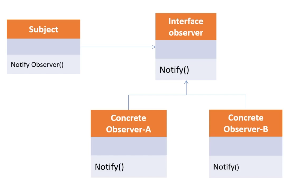

    # Adapter Pattern Principles

## 원리

Observer_Pattern은 변화가 일어 났을 때, 미리 등록된 클래스에 통보해주는 패턴을 구현한 것입니다.
많이 보이는 곳은 Event listener에서 패턴을 사용하고 있습니다.

이 부분은 현실 세계에서도 예를 들 수 있습니다.

교실에서 망을 보다가, 선생님이 오신다 그러면 친구들에게 Event를 전달해주는 것을
Observer 예를 들 수 있습니다.